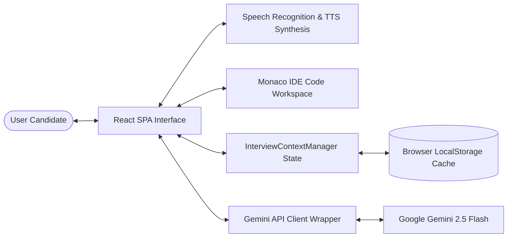
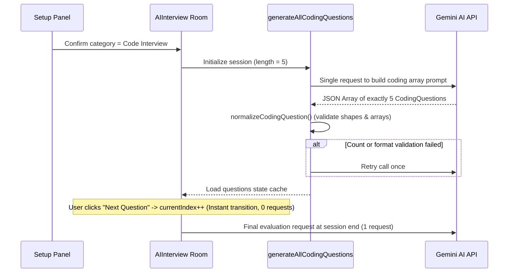

# Architecture Documentation - InterviewPilot AI

This document provides a detailed technical overview of the design patterns, component hierarchies, data flows, and state management systems governing **InterviewPilot AI**.

---

## 1. High-Level System Architecture

InterviewPilot AI is a serverless, client-side React SPA (Single Page Application) that communicates directly with Google's Gemini Pro/Flash AI APIs. The application acts as a stateful client managing candidate speech recognition, conversational context, IDE environments, and grader analytics.



---

## 2. Component Hierarchy

```
App
├── NavigationHeader
├── ActiveSessionBanner
└── Main Layout Routing
    ├── LandingPage
    ├── Settings
    ├── History
    ├── Replay
    ├── CareerInsights
    │   └── AtsCard
    ├── Dashboard
    │   ├── AnimatedNumber
    │   └── AtsCard
    ├── InterviewSetup
    └── AIInterview
        ├── LoadingScreen
        ├── ErrorScreen
        ├── InterviewHeader
        ├── InterviewControls
        ├── InterviewFooter
        ├── TextInterview
        └── CodeInterview
            ├── CodeToolbar
            ├── CodeEditor
            ├── LanguageSelector
            └── ResultPanel
```

---

## 3. Routing Structure

The application uses `HashRouter` to manage client-side navigation paths. Hash routing is utilized to prevent server routing issues upon page reloads on static hosting environments (such as Vercel or GitHub Pages).

* `/` - **Landing Page:** Project promo, hero headers, feature highlights, and FAQs.
* `/setup` - **Setup Panel:** Selection selectors for role, difficulty, interview type, company rounds.
* `/interview` - **Active Room:** Dictation interfaces, floating controls, and Monaco IDE screens.
* `/dashboard` - **Scorecard Page:** Radar charts, communication metrics, and recommendations.
* `/replay` - **Replay Room:** Step-by-step chat history transcript and code files viewer.
* `/insights` - **Insights Board:** Resume comparisons, weekly action roadmaps, and career tools.
* `/history` - **Archive lists:** List of all mock records stored in history database.
* `/settings` - **Settings Room:** Theme adjustments, auto-voice setups, duration configs, and API key inputs.

---

## 4. Key Architectural Flows

### A. Gemini Request Flow
```mermaid
sequenceDiagram
    participant UI as AIInterview UI
    participant Service as GeminiInterviewService
    participant Retry as RetryManager
    participant Gemini as Gemini AI API
    
    UI->>Service: Trigger question request
    Service->>Retry: execute(executeCall)
    loop Up to 3 times (Transient errors)
        Retry->>Gemini: callGenAiSdk(prompt)
        alt Success
            Gemini-->>Retry: Pure JSON text
            Retry-->>Service: Return text
        else Transient Error (e.g., 503)
            Gemini-->>Retry: Status 503
            Note over Retry: Delay and retry
        else Quota Error (429)
            Gemini-->>Retry: Status 429 (RESOURCE_EXHAUSTED)
            Note over Retry: Do NOT retry; throw instantly
            Retry-->>UI: Propagate 429 error
        end
    end
    Service-->>UI: Cleaned JSON object
```

### B. Resume Analysis Flow
1. User uploads a PDF/TXT resume on the **Setup Page**.
2. Frontend extracts resume text contents.
3. System calls `analyzeResume()` checking `ResumeCache`. If cached details match, it skips calling Gemini.
4. Gemini returns a structured `ResumeAnalysisResult` parsing experience level, skills list, and projects.
5. This context is kept in state and appended as metadata to customize subsequent questioning.

### C. Code Interview Preloading Flow


---

## 5. System Components & Utilities

### A. PromptBuilder
The `PromptBuilder` utility compiles dynamic, context-aware prompt templates for the Gemini API.
* **Role/Difficulty Integration:** Templates inject candidate targets, adjusting technical expectations.
* **Conversational Styles:** Enforces professional interviewer tones, prohibiting praise sentences.
* **Company Profiles:** Injects preferred subjects, difficulty distributions, and structural guidelines matching Google, Meta, Amazon, etc.
* **Strict JSON Directives:** appends strict formatting rules (`Return ONLY JSON`, `No markdown code fences`) to make parsing resilient.

### B. InterviewContextManager
Tracks current session conversations, keeping in-memory context:
* **questionsAsked:** Tracks raw text or structured objects.
* **candidateAnswers:** Log of user transcript submissions.
* **coveredSkills:** Extracted demonstrated technologies.
* **weaknessesDetected:** Identified focus sections requiring improvement.
* **difficulty:** Current difficulty tier.

### C. Caching System
To reduce API costs and improve loading times, InterviewPilot AI implements double-layer caching:
* **ResumeCache:** Caches parsed resume analysis values using resume text hashes as key entries.
* **AnalysisCache:** Caches weekly roadmap curriculums and scorecard summaries.

### D. Retry & LocalStorage Architecture
* **LocalStorage auto-save:** The active session states (timers, answers, questions lists) are stringified and stored in `interviewpilot_active_session` on every state change. On window reload, users are offered to restore their exact state.
* **Network resilience:** `RetryManager` intercepts network dropouts (status 0/offline) and server outages (503), retrying up to 3 times with exponential backoff delays.

---

## 6. Error Handling Strategy

| Error Scenario | Detection Point | UI State Resolution |
| :--- | :--- | :--- |
| **Invalid API Key** | Gemini SDK 401 response | Redirects to Settings page; displays instructions to paste a valid key. |
| **Quota Exceeded** | Gemini SDK 429 response | Displays a friendly Rate Limit screen advising the user to wait a minute before retrying. |
| **Network Offline** | `navigator.onLine === false` | Renders a WifiOff screen advising checking connection; stops API attempts. |
| **Malformed JSON** | `cleanAndParseJson()` exception | Triggers a validation fallback matching default local coding stubs. |
| **Validation Failures** | `normalizeCodingQuestion()` returns null | Initiates a single-retry count check. Gracefully ends interview if retry fails. |

---

## 7. Folder Structure & Code Layout

```
InterviewPilot-AI/
├── public/                 # Static assets, mockups, and icons
├── src/
│   ├── assets/             # Graphical gradients and background vectors
│   ├── components/         # Page components
│   │   ├── ui/             # Reusable UI elements (Card, Button, Badge)
│   │   ├── Interview/      # Split-pane Monaco workspace components
│   │   ├── AIInterview.tsx # Main mock room container
│   │   ├── Dashboard.tsx   # Scoring summaries, SVG radars, and trimmers
│   │   ├── Settings.tsx    # Configuration panel (API keys, durations)
│   │   ├── ErrorBoundary.tsx # UI fallback containing error details
│   │   └── PrintableReport.tsx # Optimized page-break print styles
│   ├── contexts/           # Settings Context (Themes, IDE preferences)
│   ├── hooks/              # Speech recognition, audio context level controls
│   ├── services/           # Gemini prompt builder, Judge0 compiler wrappers
│   ├── types/              # TS schemas (CodingQuestions, Evaluators)
│   └── utils/              # Export engines (plain-text, PDF printing)
```

---

## 8. Code Compilation & Judge0 Integration

The code compiler simulation has been replaced with the **Judge0 CE API Integration** inside [judge0.ts](file:///c:/Users/Admin/Documents/Career/Certificates/Projects/src/services/judge0.ts).

### Data Encoding & Mappings
* **Base64 Payload Wrappers:** To prevent compilation errors on Unicode symbols (such as comment strings or emoji print lines), source code inputs and console outputs are converted using UTF-8 safe base64 codecs (`btoa(unescape(encodeURIComponent(str)))` and matching decoders).
* **Language ID Mapping:** Programming languages are translated to Judge0 CE IDs:
  * C: `50` (GCC 9.2.0)
  * C++: `54` (GCC 9.2.0)
  * Java: `91` (JDK 17.0.6)
  * JavaScript: `93` (Node.js 18.15.0)
  * Python: `92` (Python 3.11.2)

### Asynchronous Execution Pipeline
1. Candidate inputs code into `CodeEditor` (monaco).
2. Clicking "Run Code" instantiates an `AbortController` and signals a `POST` request containing base64 source code and stdin parameters to `/submissions?base64_encoded=true&wait=true`.
3. If the user navigates away or starts a new compile cycle, the active fetch is aborted.
4. Output stats (stdout, stderr, compile errors, runtime, memory) are passed to `ResultPanel` (memoized) to update the UI.

---

## 9. Data Export System

The export utility parses active candidate profiles and outputs evaluation scorecards in two format variants:

1. **Structured Text Files (`downloadTxtFile`):**
   * Translates the JSON scorecard array into a plain-text template.
   * Downloads transcript details, target metadata, overall grades, specific metrics, coach comments, and roadmap steps.
2. **Optimized PDF/Print Layouts (`window.print()`):**
   * Triggers a browser print dialogue.
   * Renders the hidden [PrintableReport.tsx](file:///c:/Users/Admin/Documents/Career/Certificates/Projects/src/components/PrintableReport.tsx) layout.
   * Print styles hide control buttons, inputs, headers, and footers (`no-print` classes) and reset layout backgrounds to clean white/black print colors with explicit `@media print` CSS configurations.

