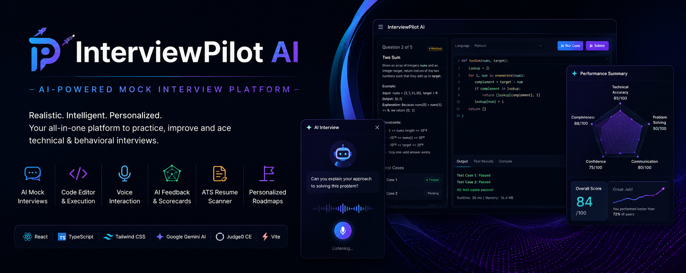
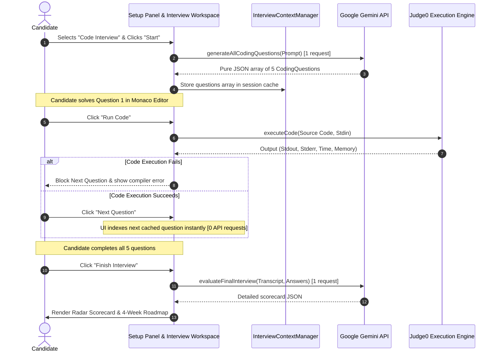
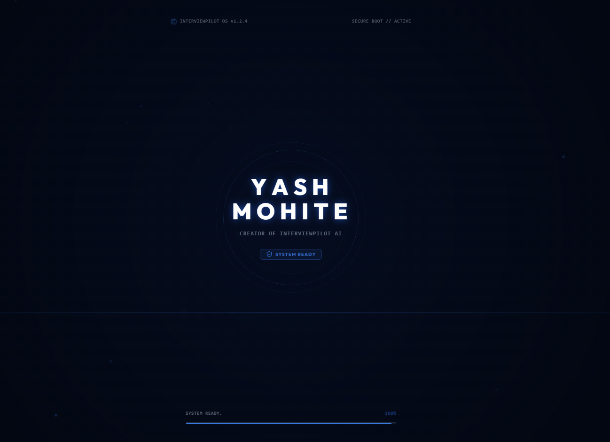
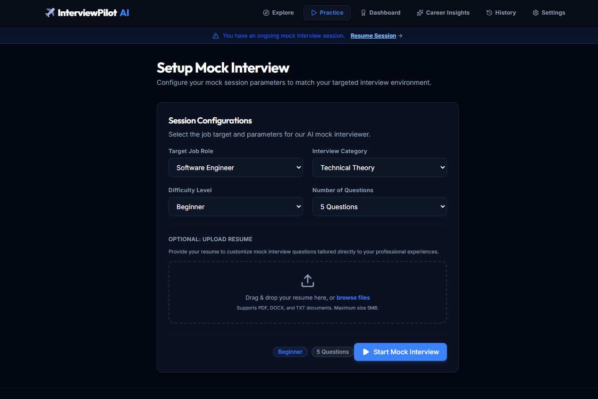
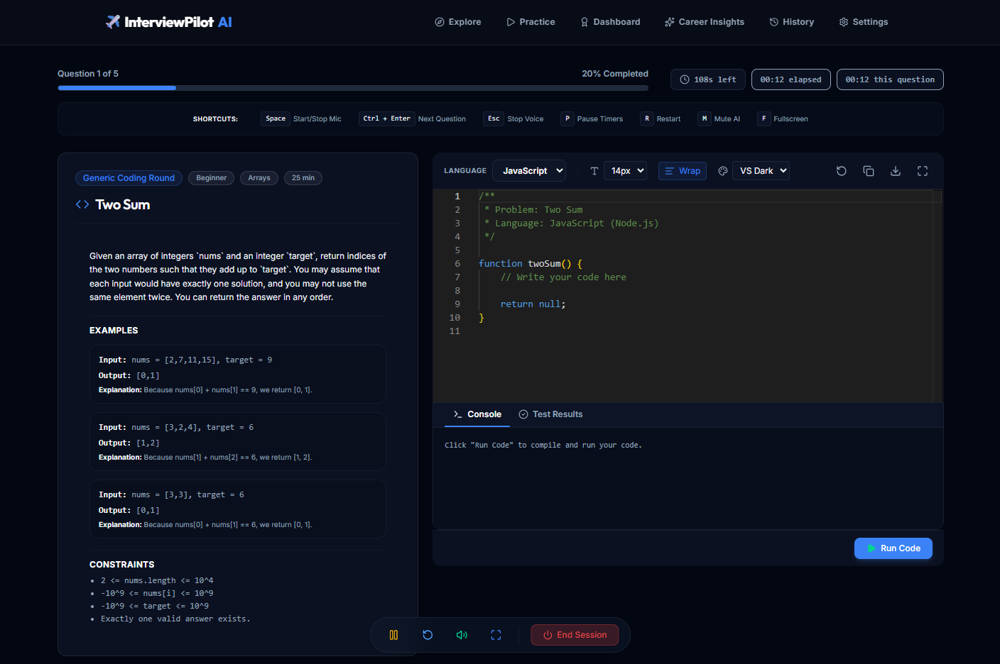
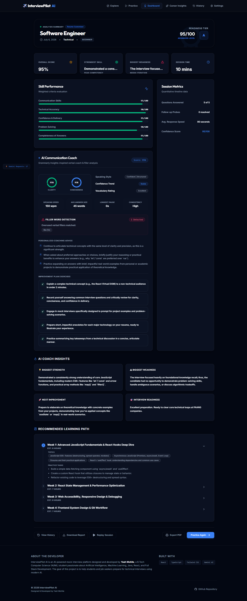

# ✈️ InterviewPilot AI

<p align="center">
  
</p>

<div align="center">
<p align="center">
  
</p>

  <p align="center">

[](https://react.dev/)
[](https://www.typescriptlang.org/)
[](https://tailwindcss.com/)
[](https://ai.google.dev/)
[](https://judge0.com/)
[](LICENSE)

</p>
</div>

---

## 📖 Project Overview

Preparing for modern technical and behavioral interviews can be a daunting, high-anxiety process. Traditional mock interviews are difficult to schedule, expensive, and often lack rigorous, objective feedback. **InterviewPilot AI** solves this by delivering an interactive, voice-enabled, browser-native mock interview simulator. It leverages state-of-the-art Generative AI to mimic realistic corporate interview rounds, providing candidates with instant grading, gap analyses, and weekly roadmap recommendations.

The platform is designed around a fully client-side architecture. It prioritizes data privacy by storing Gemini API keys and past interview histories exclusively in browser `localStorage`. Rather than relying on simple question lists, the simulator features follow-up interrogations, dynamic voice synthesis, a split-pane Monaco IDE, and Judge0-based code execution.

To guarantee performance on the Gemini API free tier, the platform implements preloading optimizations. For coding interviews, all questions are generated in a single API transaction at startup, enabling network-resilient local navigation and dropping API resource exhaustion (`429`) errors to zero during active sessions.

---

## 🔗 Live Demo & Mockups

* **Live Platform Application:** **[InterviewPilot AI Web Application](https://yash-interviewpilot-ai.vercel.app)**

<!-- TODO: Add demo-walkthrough.gif to screenshots/ folder
<div align="center">
  
</div>
-->

---

## 🌟 Key Features

### 🎙️ Multi-Format Interview Rooms
* **Technical Theory Rounds:** Focuses on system design, data structures, algorithms, databases, and general programming concepts.
* **Behavioral Rounds:** Uses STAR methodology checks (Situation, Task, Action, Result) to evaluate collaboration, leadership, and culture.
* **Resume-Based Rounds:** Parses candidate resume profiles (PDF/DOCX) to ask deep questions tailored to self-reported skills, projects, and work experiences.

### 💻 Monaco IDE & Judge0 Code Execution
* **Split-pane Code Editor:** Solve coding problems inside a VS Code-grade Monaco Editor with customizable theme options, font sizing, and word-wrapping.
* **Real-time Code Execution:** Integrates Judge0 CE API to compile and run C, C++, Java, JavaScript, and Python code, returning stdout, stderr, compile errors, runtime durations, and memory consumption.
* **AI Code Evaluation:** AI grades code formatting, clean-code practices, and time/space complexity calculations. Progression is blocked on execution errors to prevent faulty submissions.

### 🗣️ Native Voice Recognition & Synthesis
* **Web Speech Integration:** Translates candidate speech to text in real-time. Speeches are read aloud by the mock interviewer using natural speech synthesizers, featuring auto-play and mute configurations.

### 🏢 Corporate & Role-Specific Tracks
* **Company-Specific Coding Rounds:** Simulates interview styles of major tech organizations including **Google, Amazon, Microsoft, Meta, TCS, Infosys, and Accenture**. Prompt biases adjust topics (e.g. Graphs/DP for Google, HashMaps/Strings for Amazon) to mimic corporate rounds.

### 📊 Scorecards & Career Insights
* **Interactive SVG Radar Charts:** Instant grade breakdown across 5 critical dimensions: Technical Accuracy, Communication, Confidence, Problem Solving, and Completeness.
* **ATS Resume Scanner:** Redirection cards to analyze resume structures, keywords, and job readiness index.
* **Personalized Curriculums:** Generates a custom 4-week study roadmap complete with learning goals, practice tasks, and study links tailored directly to detected candidate weaknesses.

---

## 🛠️ Technology Stack

| Layer | Technology | Purpose |
| :--- | :--- | :--- |
| **Frontend Core** | React 19 + TypeScript 5 | Stateful component hierarchy and strict type checks. |
| **Styling Engine** | Tailwind CSS v4.0 | Responsive glassmorphic dark theme dashboard. |
| **Editor** | `@monaco-editor/react` | Full VS Code Monaco Editor with theme preferences. |
| **AI Integration** | Google Gen AI SDK (`@google/genai`) | Gemini 2.5 Flash API executing prompts and grading scorecards. |
| **Code Execution** | Judge0 CE API | Remote code compilation and execution engine. |
| **Motion Library** | Framer Motion | Fluid transitions, accordion animations, and modal overlays. |
| **Testing** | Vitest | Fast E2E unit testing for Gemini schema validation. |
| **Bundling** | Vite 8 | Code-splitting, CSS extraction, and dev server. |

---

## 📐 Architecture & Data Flow

The following diagram illustrates the sequence of actions when starting and evaluating a Code Interview session:



---

## 📂 Project Folder Structure

```
InterviewPilot-AI/
├── public/                 # Static assets, logos, and icons
├── src/
│   ├── assets/             # Graphics and gradients
│   ├── components/         # Page components
│   │   ├── ui/             # Reusable UI elements (Card, Button, Badge)
│   │   ├── Interview/      # Code Interview workspace components
│   │   │   ├── CodeEditor.tsx
│   │   │   ├── CodeToolbar.tsx
│   │   │   ├── CodeInterview.tsx
│   │   │   ├── ResultPanel.tsx
│   │   │   └── LanguageSelector.tsx
│   │   ├── AIInterview.tsx # Main conversational orchestrator
│   │   ├── Dashboard.tsx   # Scoring analytics and Radar graphs
│   │   ├── Settings.tsx    # Preferences and local key management
│   │   ├── ErrorBoundary.tsx # Collapsible debug details UI
│   │   └── PrintableReport.tsx # PDF printable CSS report template
│   ├── contexts/           # Settings & Voice contextual state provider
│   ├── hooks/              # SpeechRecognition & volume controllers
│   ├── services/           # Gemini APIs, Judge0 client, & templates
│   ├── types/              # Discriminated union typescript models
│   └── utils/              # Export formats and printer triggers
├── tsconfig.json           # TS configuration
├── vite.config.ts          # Vite build parameters
└── package.json            # Scripts & dependencies
```

---

## ⚙️ Installation & Setup

### Prerequisites
* **Node.js**: v20 or later.
* **NPM**: v10 or later.

### Steps

1. **Clone the Repository:**
   ```bash
    git clone https://github.com/yashcodess/InterviewPilot-AI.git
    cd InterviewPilot-AI
   ```

2. **Install Dependencies:**
   ```bash
   npm install
   ```

3. **Configure Environment Variables:**
   Create a `.env` file in the root directory:
   ```env
   # Google Gemini API Key
   VITE_GEMINI_API_KEY=your_gemini_api_key_here

   # Judge0 API Key & Endpoint (Optional: Default values point to public CE endpoints)
   VITE_JUDGE0_API_URL=https://judge0-ce.p.rapidapi.com
   VITE_JUDGE0_API_KEY=your_rapidapi_key_here
   VITE_JUDGE0_HOST_HEADER=judge0-ce.p.rapidapi.com
   ```
   *Note: Candidates can also configure and save their Gemini API key inside the app Settings page. Keys are stored safely inside browser LocalStorage and never leave the client.*

4. **Start Development Server:**
   ```bash
   npm run dev
   ```
   Open your browser and navigate to `http://localhost:5173`.

5. **Run Test Suites:**
   ```bash
   npm run test
   ```

6. **Build for Production:**
   ```bash
   npm run build
   ```

---

## ⚙️ Environment Variables Reference

| Variable | Required | Default Value | Description |
| :--- | :---: | :--- | :--- |
| `VITE_GEMINI_API_KEY` | Yes (or in app) | `""` | API Key obtained from Google AI Studio. |
| `VITE_JUDGE0_API_URL` | No | `https://judge0-ce.p.rapidapi.com` | Base URL of the Judge0 compiler engine. |
| `VITE_JUDGE0_API_KEY` | No | `""` | Auth key for Judge0 compiler service. |
| `VITE_JUDGE0_HOST_HEADER` | No | `judge0-ce.p.rapidapi.com` | Host header required by RapidAPI gateways. |

---

## 🔄 Project Workflow

```
1. Setup Panel
   ├── Enter target role (e.g. Frontend Engineer)
   ├── Select interview type & difficulty
   ├── Choose Company rounds (e.g. Google)
   └── Upload Resume (Optional)
          │
          ▼
2. Active Interview Room
   ├── Read/Listen to question
   ├── Record audio response (Speech-to-Text)
   ├── Answer follow-up questions dynamically
   └── Solve code challenges inside Monaco IDE
          │
          ▼
3. Final Evaluation
   ├── Review 5-dimension Radar Chart grading
   ├── Study actionable improvement feedback
   └── Access custom 4-week learning roadmap
```

---

## 🧠 Deep-Dives

### 1. AI Pipeline & Prompt Orchestration
The app handles AI interactions via a stateful client wrapper. The `PromptBuilder` utility compiles context-aware system instructions:
* ** STAR Methodology Checks:** Behavioral prompts guide the model to check if answers describe a Situation, Task, Action, and Result.
* **Strict JSON Directives:** Gemini is instructed to return *only* pure JSON strings matching TypeScript schemas. Fences (` ```json `) are programmatically cleaned before parsing.
* **On-the-fly Evaluations:** Answers are scored in real-time, allowing the AI to detect logical flaws and trigger follow-up questions.

### 2. Double-Layer Caching Strategy
To reduce API overhead and latency:
* **Resume Cache:** Text contents of uploaded resumes are hashed. The hash is mapped to the extracted `ResumeAnalysisResult` in `localStorage`. Uploading the same resume is instantaneous.
* **Analysis Cache:** Scorecards and roadmap outputs are cached to prevent double-billing on page refreshes or dashboard re-entries.

### 3. Preloaded Code Interview Mode
Unlike normal interviews where each "Next Question" triggers a Gemini call, the Code Interview mode generates all 5 coding problems in **one single API call at session start**.
* Questions are stored in the local `questions` array.
* Switching between questions takes `0ms` and requires `0` API calls.
* Compilation is executed remotely on Judge0 CE, returning standard output and memory usage.
* A final Gemini call is made at the end of the session to generate the overall scorecard, reducing total Gemini calls for a 5-question coding interview from **6 down to 2**.

### 4. ATS Resume Scanner Integration
The platform embeds glassmorphic redirection cards that link to an external/internal ATS Resume Scanner. Candidates can cross-reference their resume format, parsing compatibility, and keyword metrics, updating their active profile before starting a mock session.

---

## 🖼️ User Interface Screenshots

* **Landing page:** 
* **Practice Setup:** 
* **Code Workspace:** 
* **Radar Dashboard:** 

---

## 🚀 Deployment Guide

### Vercel (Recommended)
The built output is a static single-page application.
1. Install Vercel CLI: `npm install -g vercel`
2. Run `vercel` from the root directory.
3. Configure the output folder to `dist`.

### GitHub Pages
1. Set the correct base path in `vite.config.ts` (e.g. `base: '/repo-name/'`).
2. Run `npm run build`.
3. Use the `gh-pages` NPM package to push the `dist/` directory to the `gh-pages` branch.

---

## 🔮 Future Roadmap (Version 2)
* **Webcam Eye-Tracking:** Integrate lightweight TensorFlow.js face/mesh models to track visual focus, gaze direction, and confidence.
* **Shared Lobby Peer Reviews:** Allow multiple candidates to enter a shared mock room to peer-grade code and record mock sessions.
* **Aptitude & System Design Boards:** Interactive whiteboard panels for system design rounds and aptitude logic tests.

---

## 📄 License

Distributed under the MIT License. See `LICENSE` for more information.

---

## 👤 Author & Credits

* **Yash Mohite** - B.Tech Computer Science (AI/ML) Student.
* **GitHub Profile:** [yashcodess](https://github.com/yashcodess)
* **LinkedIn:** [Yash Mohite](https://linkedin.com)

---

## 🤝 Contributing

Contributions are welcome! Please follow the guidelines in [DEVELOPMENT.md](DEVELOPMENT.md) before opening pull requests.
